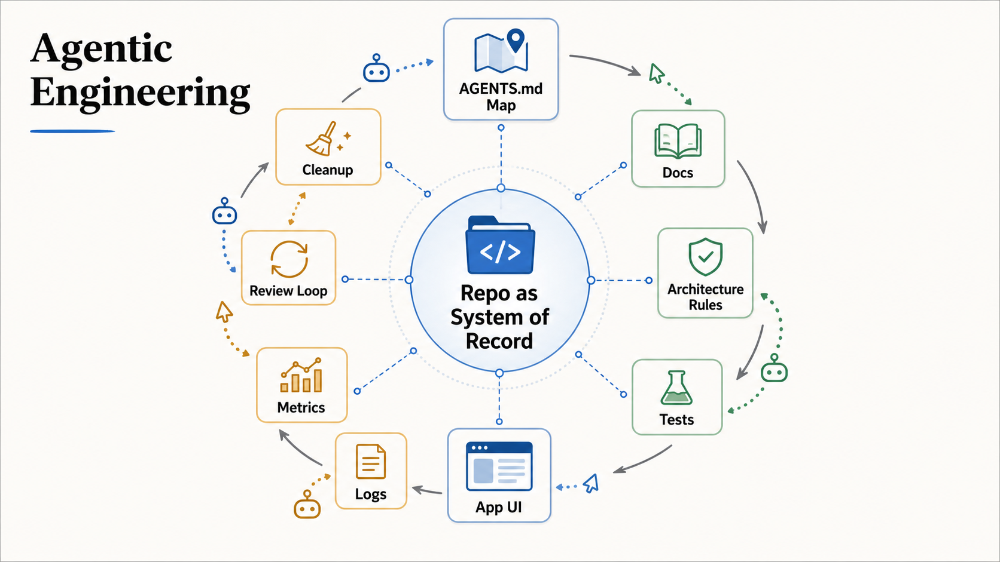

# Agentic Engineering

Agentic engineering is the discipline of doing software engineering with coding
agents: deciding what to build, shaping what the agent sees, designing the
environment it works in, defining how its output is judged, and owning the
result as a team.

This repo is a knowledge base of agent-readable principle briefs. Each brief is
a high-fidelity public translation of one or more source articles, so human and
agent readers can understand and apply the concepts without reading every source.
Harness engineering is one concept within the discipline, not a synonym for it.

## Where To Start

Pick the brief that matches your question:

- Designing the environment an agent works in (repo layout, docs, tools,
  runtime access, review loops) → [Harness Engineering](principles/harness-engineering.md)
- Deciding what the agent should see at each step (prompts, tools, retrieval,
  memory, compaction) → [Context Engineering](principles/context-engineering.md)
- Choosing feedback signals and checks for agent output →
  [Harness Sensors](principles/harness-sensors.md)
- Understanding why encoding rules, migrations, and ratchets is now worth it →
  [Production Function Changed](principles/production-function-changed.md)
- Defining what done and good mean, and how reviews should behave →
  [Good Job Spec](principles/good-job-spec.md)
- Structuring code so agents can follow it →
  [Code as Conceptual Model](principles/code-as-conceptual-model.md)
- Team adoption, maintenance, and ownership around agents →
  [Faster Was The Problem](principles/faster-was-the-problem.md)

## Principles

- [Harness Engineering](principles/harness-engineering.md) — the repository,
  tools, feedback loops, and constraints that let agents do reliable work;
  translation of OpenAI's harness engineering article.
- [Context Engineering](principles/context-engineering.md) — context as a finite
  attention budget: curating prompts, tools, examples, history, retrieval,
  memory, and compaction so the agent sees the right working set.
- [Harness Sensors](principles/harness-sensors.md) — the feedback side of the
  harness: sensors, computational checks, and agent self-correction.
- [Code as Conceptual Model](principles/code-as-conceptual-model.md) — why code
  remains valuable as vocabulary, abstraction, and shared understanding in the
  LLM era.
- [Good Job Spec](principles/good-job-spec.md) — why agents need written
  verification criteria for taste, risk, review, doneness, and proof.
- [Production Function Changed](principles/production-function-changed.md) — why
  cheaper implementation changes the economics of migrations, rules, tests, and
  ratchets.
- [Faster Was The Problem](principles/faster-was-the-problem.md) — why faster AI
  output raises the bar for engineering judgment, maintenance, adoption, and
  workflow design.

## Mental Model

Agentic engineering is not prompt engineering with a larger README. It is closer
to platform engineering for a new kind of worker:

- make the environment inspectable
- make the right path easy
- make the wrong path fail clearly
- make feedback durable
- make cleanup continuous

The better the harness, the less the human has to babysit individual changes.
