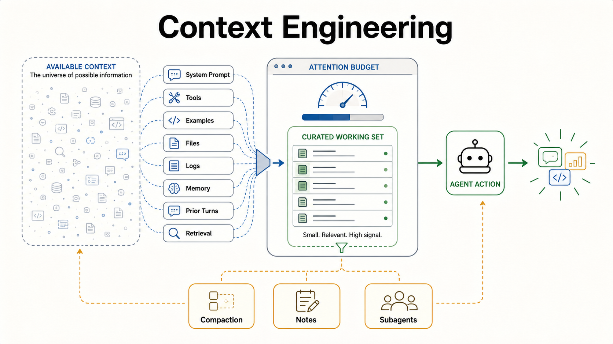

# Context Engineering

Context engineering is the practice of curating what an AI agent can see at
each step of its work. It treats the model context window as a scarce working
set, not as a place to dump every instruction, log, document, and prior turn.

This brief is derived from Anthropic's article
["Effective context engineering for AI agents"](https://www.anthropic.com/engineering/effective-context-engineering-for-ai-agents),
published September 29, 2025 by Anthropic's Applied AI team. Supporting sources
include Thoughtworks' Technology Radar blip
["Context engineering"](https://www.thoughtworks.com/radar/techniques/context-engineering),
Thoughtworks' blip
["Progressive context disclosure"](https://www.thoughtworks.com/en-us/radar/techniques/progressive-context-disclosure),
Birgitta Böckeler's Martin Fowler article
["Context Engineering for Coding Agents"](https://martinfowler.com/articles/exploring-gen-ai/context-engineering-coding-agents.html),
and the related Martin Fowler article
["Harness engineering for coding agent users"](https://martinfowler.com/articles/harness-engineering.html).

It is a companion to [Harness Engineering](harness-engineering.md) and
[Harness Sensors](harness-sensors.md). Harness engineering asks what
environment must exist. Context engineering asks what the model should see while
working. Harness sensors ask whether the produced work is good enough.

## Core Frame

Context is an attention budget.

Modern models can accept large context windows, but large does not mean free.
Every extra token competes with the rest of the working set. Instructions, tool
schemas, retrieved documents, file reads, logs, examples, memory, prior turns,
plans, and sensor output all spend from the same budget.

The goal is not the largest possible prompt. The goal is the smallest
high-signal working set that makes the desired behavior more likely.

That makes context engineering broader than prompt engineering:

| Discipline | Primary question |
| --- | --- |
| Prompt engineering | How should the request be worded? |
| Context engineering | What should be visible to the model at this turn? |

Prompt wording still matters, but agents accumulate state as they work. Each
turn creates possible new context: tool results, discoveries, errors, summaries,
plans, and decisions. The engineering problem is deciding what stays in the
window, what gets compacted, what lives outside the window, and what should be
retrieved only when needed.

## Article Spine

The source article follows this conceptual order:

| Source article section | Public repo translation |
| --- | --- |
| Context engineering vs. prompt engineering | Context engineering manages the full inference state, not only prompt text. |
| Why context engineering matters | Context windows are finite attention budgets and can suffer from context rot. |
| Anatomy of effective context | System prompts, tools, examples, and message history all need curation. |
| Context engineering for long-horizon tasks | Compaction, note-taking, and subagents keep work coherent beyond one window. |
| Conclusion | Reliable agents need dynamic context pipelines, not static document dumps. |

## Anatomy Of Effective Context

Effective context has several competing parts.

| Context part | Useful when | Risk when overused |
| --- | --- | --- |
| System prompt | The agent needs stable role, policy, or operating rules. | It becomes a brittle program full of branches and caveats. |
| Tools and MCP servers | The agent needs to inspect, act, or retrieve outside the model. | Tool schemas and noisy results consume tokens and invite wandering. |
| Examples | The desired output has a pattern that is easier to show than describe. | Examples overpower the actual task or create cargo-cult behavior. |
| Message history | Prior turns carry decisions, constraints, and unresolved work. | The agent drags stale assumptions forward. |
| File reads | The source tree is the live system of record. | Too many files blur ownership and make the model reason from fragments. |
| Logs and sensor output | Runtime evidence or validation explains what actually happened. | Raw dumps hide the signal the agent needs to repair. |
| Memory and notes | Durable lessons or compact state should survive turns. | Old context can become stale authority unless rechecked. |

The practical rule is progressive disclosure: start with routing context, then
load the narrow source of truth when the task needs it.

## AGENTS.md Routes

`AGENTS.md` should route, not recite.

An agent entrypoint works best as a map:

- what kind of repo is this?
- which principles govern common tasks?
- where are the durable source-of-truth docs?
- which commands prove the work?
- where should new learnings, mistakes, plans, or debt be recorded?

It should not preload every principle, convention, exception, and historical
decision. A large instruction file can feel safer to humans while making the
agent's actual working set worse.

Principle briefs should behave like deep links. They are available when relevant
but should not be treated as always-loaded manuals.

## Tools Are Context

Tools are not outside the context problem. Their names, descriptions, parameter
schemas, output shapes, and error messages all shape agent behavior.

Good tools:

- have clear, non-overlapping responsibilities
- return compact, structured results
- expose enough evidence for the next decision
- fail with remediation guidance
- avoid dumping raw data when a summary or selector would do

Bad tools spend context twice: once through a confusing interface and again
through verbose output the agent must sift through.

This is why harness design and context design meet at the tool boundary. A tool
is both a capability and a context interface.

## Retrieval And Progressive Disclosure

Just-in-time retrieval keeps the working set focused.

Useful retrieval handles include:

- file paths
- source links
- short indexes
- named principles
- saved queries
- plan IDs
- log bundle IDs
- test names
- error fingerprints

The agent can start from a lightweight map, then retrieve the specific artifact
that matters. This preserves attention while keeping deeper knowledge
discoverable.

Pure just-in-time retrieval is not always enough. Some domains need pre-indexed
knowledge, curated examples, or prepared reference sets because the right source
is hard to discover under time pressure. The stable pattern is hybrid: preload
small routing context, keep durable knowledge indexed, and pull detailed context
only when the task calls for it.

## Long-Horizon Context

Long work needs state outside the model window.

Useful techniques:

- **Compaction** turns a long conversation or tool trail into a smaller,
  high-fidelity continuation state.
- **Structured notes** keep durable discoveries, assumptions, blockers, and
  acceptance criteria outside the transient chat window.
- **Plans** preserve task state, sequence, validation, and decisions across
  interruptions.
- **Subagents** isolate work in separate context windows, then return summaries
  or findings to the lead agent.
- **Sensor summaries** compress validation output into the signal needed for the
  next repair.

The point is not to make agents remember everything. The point is to preserve
the right state in the right place.

## Context Quality Is Harness Quality

Context quality is part of harness quality.

If an agent fails because it did not see the right files, docs, examples, tools,
logs, tests, or prior decisions, that is not only a prompt failure. It is a
harness signal.

Useful responses:

- missing context becomes repo content
- missing routes become `AGENTS.md` or README links
- missing capabilities become tools or skills
- noisy tool output becomes structured output
- repeated confusion becomes a principle, check, or example
- long-running state becomes a plan, note, or compaction artifact

Harness sensors evaluate what the agent produced. Context engineering improves
what the agent can see before and during that production.

## Concept Fidelity Map

| Source concept | Preserved here as | Why it matters |
| --- | --- | --- |
| Context engineering | Curation of the model's visible working set | Agents need more than well-worded prompts. |
| Prompt engineering distinction | Prompt wording vs. full inference state | Prevents collapsing the discipline into prompt tips. |
| Finite context | Attention budget | Larger windows still require prioritization. |
| Context rot | Degraded reasoning from noisy or oversized context | More context can reduce quality instead of improving it. |
| Anatomy of context | Prompts, tools, examples, history, files, logs, memory | All inputs compete for the same window. |
| Tool design | Tools as context interfaces | Tool schemas and outputs shape behavior. |
| Progressive disclosure | Routing first, detail on demand | Keeps `AGENTS.md` and principle briefs lightweight. |
| Just-in-time retrieval | Load the narrow source when needed | Lets agents work from deep links instead of dumps. |
| Hybrid retrieval | Pre-index when discovery is hard | Some domains need prepared knowledge surfaces. |
| Compaction | High-fidelity continuation state | Long tasks need continuity beyond one window. |
| Structured note-taking | External working memory | Durable state should not depend on chat history alone. |
| Subagents | Context isolation | Separate windows can explore or review without polluting the lead context. |

## Relationship To Harness Engineering

[Harness Engineering](harness-engineering.md) describes the repository, tools,
runtime access, feedback loops, and cleanup systems that let agents work with
less babysitting.

Context engineering zooms in on the agent's working set inside that harness. A
good harness makes the right context easy to find without loading everything by
default.

[Harness Sensors](harness-sensors.md) are the output side of the loop: they
inspect what the agent produced and return repair signals. Context engineering
is the input and in-flight side: it decides what the model sees before it acts
and what state stays visible as work continues.

[Code as Conceptual Model](code-as-conceptual-model.md) explains why the
codebase itself is a powerful context surface. Good names, boundaries, tests,
and examples reduce the amount of prose an agent needs before it can make a
coherent change.
