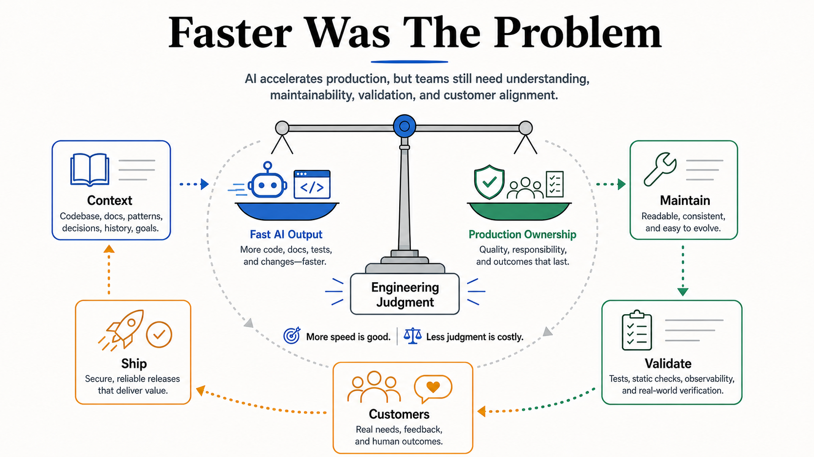

# Faster Was The Problem

Faster AI output is not automatically better engineering. It lowers the cost of
producing code, tests, docs, and plans, but it does not remove the cost of
understanding, maintaining, validating, adopting, and owning what gets shipped.

This brief is derived from David Fowler's LinkedIn article
["AI Made Us Faster. That Was the Problem"](https://www.linkedin.com/pulse/ai-made-us-faster-problem-david-fowler-mgnzc),
published May 12, 2026. The article is grounded in the Aspire team's
experience: a roughly two-and-a-half-year-old open-source app-orchestration
platform whose team is rebuilding its engineering loop to be AI-first, rather
than a greenfield agent experiment. It is a companion to
[Harness Engineering](harness-engineering.md), because it describes what happens
when a real product team redesigns its engineering loop around AI instead of
only using AI to generate more output.

## Core Frame

Building production software with AI is different from building demos with AI.

Agents can produce code, tests, documentation, summaries, review comments,
migration plans, and sample apps quickly. Production software is judged by a
different standard: whether the output is correct, maintainable, understandable,
useful, and aligned with customer needs.

The bottleneck moves. It does not disappear.

## Production Got Cheaper, Maintenance Did Not

The article's central warning is that the cost of production has fallen faster
than the cost of maintenance.

The source grounds this in a concrete anecdote: during a major architectural
change, one engineer produced what felt like six months of code in about a
week. The output was real, but with no back pressure on production, the team
received more code than it could absorb, understand, and review — an
overconfidence problem, not a capability problem.

That creates a new failure mode:

- more code than the team can absorb
- generated work nobody deeply understands
- noisy pull requests
- shallow reviews
- tests that prove only the happy path
- documentation that sounds right but is subtly wrong
- cleanup work that arrives after the productivity graph already looks good

This is not an argument against agents. It is an argument for stronger
engineering judgment around agents.

## Adoption Is Workflow Design

The cultural side matters because experienced engineers already have working
systems.

They know how to navigate a codebase, debug it, review changes, and sense when
something is wrong. Asking them to adopt agents means asking them to decompose
tasks differently, provide context differently, recover from bad output, and
review unfamiliar generated changes.

That can feel like regression before it feels like leverage.

Adoption is therefore not only a tooling problem. It is a confidence, trust, and
workflow-design problem.

## Agent-Readiness Is Codebase Health

Agents work best in repositories with:

- clear structure
- repeatable commands
- good tests
- useful docs
- consistent patterns
- enough context to make reasonable decisions
- harnesses that close the verification loop

A messy codebase was already expensive for humans. With agents, that mess can
scale faster.

Agent-readiness becomes part of codebase health because agents amplify both the
good and bad parts of the environment around them.

## Humans Still Carry Context

Without major breakthroughs in memory, continuity, and long-term context, human
operators still carry much of what complex work needs: product context, customer
history, architectural intent, team tradeoffs, and the reasons behind existing
decisions.

The engineering role shifts toward:

- setting direction
- providing context
- reviewing tradeoffs
- identifying risk
- deciding what is good enough to ship
- owning quality, maintainability, and direction

AI accelerates the work. Engineers still own the result.

## Redesign The Loop

The article argues that teams should not only use AI to speed up old workflows.
They need to rethink the full loop:

- planning
- implementation
- documentation
- testing
- review
- validation
- release
- customer feedback

No universal workflow fits every team. Each team needs processes that match its
codebase, product, customers, experience level, and risk profile.

## Concept Fidelity Map

| Source concept | Preserved here as | Why it matters |
| --- | --- | --- |
| Production software is not demos | Production ownership | Real code has customers, docs, tests, releases, and maintenance. |
| AI shows up across the loop | Full engineering system | Agents affect planning, docs, testing, review, validation, and release. |
| Output is not the measure | Quality bar | Production work must be correct, maintainable, useful, and aligned. |
| Production got cheaper | Faster output | More surface area can arrive faster than teams can understand it. |
| Maintenance did not get equally cheap | Ownership cost | Generated artifacts still need coherence and durability. |
| Adoption is hard | Workflow redesign | Experienced engineers must rebuild parts of working habits. |
| Agent-readiness is codebase health | Harness health | Clear structure, tests, docs, commands, and workflows reduce bad output. |
| Human carries context | Engineering judgment | Agents accelerate execution, but humans own direction and risk. |
| Redesign the loop | Team-specific operating model | The system around agents matters more than isolated prompting. |

## Relationship To Agentic Engineering

[Harness Engineering](harness-engineering.md) focuses on the repository and
tooling system that lets agents work with less babysitting.

This brief adds the team-operating layer. A good harness is not only for the
agent. It is also for the humans who must trust, review, adopt, maintain, and
own the work.

[Good Job Spec](good-job-spec.md) defines what good means. [Production Function
Changed](production-function-changed.md) explains why more quality work is now
economically possible. This brief explains why speed without ownership can still
make the system worse.
