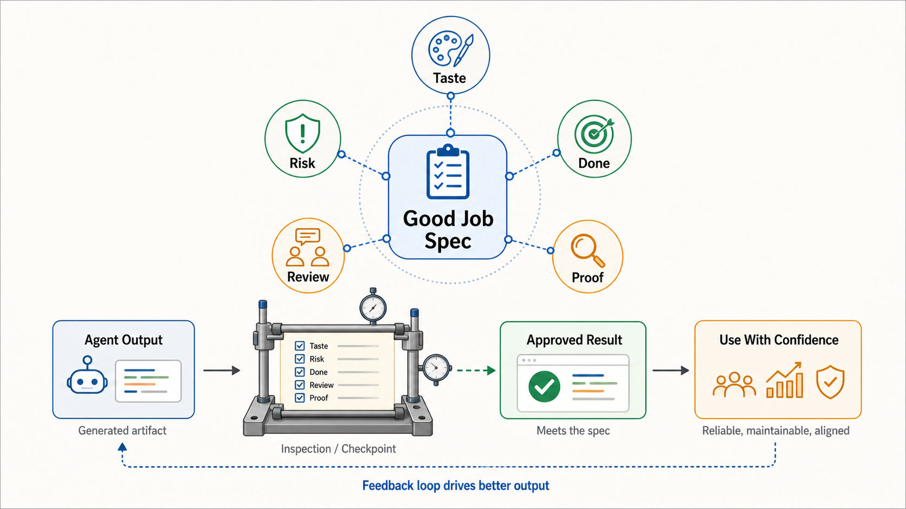

# Good Job Spec

A good job spec is the written standard that lets agents and humans decide
whether generated work is actually good enough. It captures the judgment teams
usually leave implicit: taste, risk tolerance, review posture, acceptable
shortcuts, proof, and what counts as done.

This brief is derived from Ryan Lopopolo's article
["What Does It Mean to Do a Good Job?"](https://hyperbo.la/w/what-does-it-mean-to-do-a-good-job/),
published April 10, 2026. Lopopolo also wrote the OpenAI article translated in
[Harness Engineering](harness-engineering.md); this essay generalizes lessons
from that same agent-first experiment. It is a companion to
[Harness Engineering](harness-engineering.md), because it explains why agent
harnesses need explicit quality criteria, not only instructions and tools.

## Core Frame

AI makes an old verification problem visible: every real task hides many small
decisions behind the question "what does it mean to do a good job?"

Human teams often carried those decisions through hiring, onboarding, norms, and
shared exposure to people who already knew the answer. Agents do not inherit
that context unless the repository gives it to them.

A good job spec turns implicit judgment into durable context.

It answers questions such as:

- what quality bar applies?
- what risks matter?
- what shortcuts are acceptable?
- what feedback should be fixed, deferred, or challenged?
- what proof is required?
- what does done mean for this kind of work?

## Verification Was Always The Problem

Producing work and reviewing work both depend on non-functional requirements:
tone, taste, polish, maintainability, safety, fit, risk tolerance, and the level
of confidence required before shipping.

Teams often under-specify these requirements because humans fill the gap through
social context. That breaks down with agents. A model has seen many plausible
versions of "good" across many contexts, so an underspecified task asks it to
guess which version applies here.

In an agentic repository, the missing spec should become repository content:
docs, review rules, tests, skills, examples, checklists, lints, or validation
commands.

## Review Posture

The article gives a concrete agent-review example: implementation agents need to
know how to respond to review feedback, and reviewer agents need to know when to
block versus when to unblock.

Without explicit posture, review loops can become unproductive. A reviewer may
keep finding issues while the implementer keeps reacting, and the work never
converges.

A good review spec should distinguish:

- accept and fix
- accept and defer
- push back with evidence
- merge with known minor issues
- block on material risk

That is not prompt trivia. It is part of the harness.

## Coarse Rules, Then Nuance

The article argues for writing down what good means, then adding nuance when the
coarse rule starts to overfit.

That pattern fits agentic engineering:

1. State the default rule.
2. Watch where agents misapply it.
3. Add examples, exceptions, tests, or checks.
4. Keep the spec small enough to be used.

The goal is not a giant manual. The goal is enough shared language that agents
can act, reviewers can decide, and future runs inherit the lesson.

## Concept Fidelity Map

| Source concept | Preserved here as | Why it matters |
| --- | --- | --- |
| Verification was always the problem | Good job spec | Agents expose the quality criteria humans were carrying implicitly. |
| Under-specified tasks | Hidden non-functional requirements | Taste, risk, polish, and done-ness must be named. |
| Shared human context | Repository-owned judgment | Agents need durable context instead of social absorption. |
| Reviewer/implementer behavior | Review posture | Feedback loops need merge bias, deferral rules, and pushback paths. |
| Write down what good means | Explicit verification criteria | The harness must define success before and after generation. |
| Add nuance when rules overfit | Iterative spec refinement | Good specs evolve through failures and examples. |

## Relationship To Agentic Engineering

[Harness Engineering](harness-engineering.md) says the repository becomes the
durable context boundary. A good job spec is one of the most important pieces of
that boundary.

[Harness Sensors](harness-sensors.md) covers feedback after generation. A good
job spec defines what the feedback should care about. Together they form a loop:
state what good means, generate work, inspect what happened, then improve the
spec or the sensor.

The better the spec, the less the human has to re-explain taste, risk, and
done-ness in every thread.
