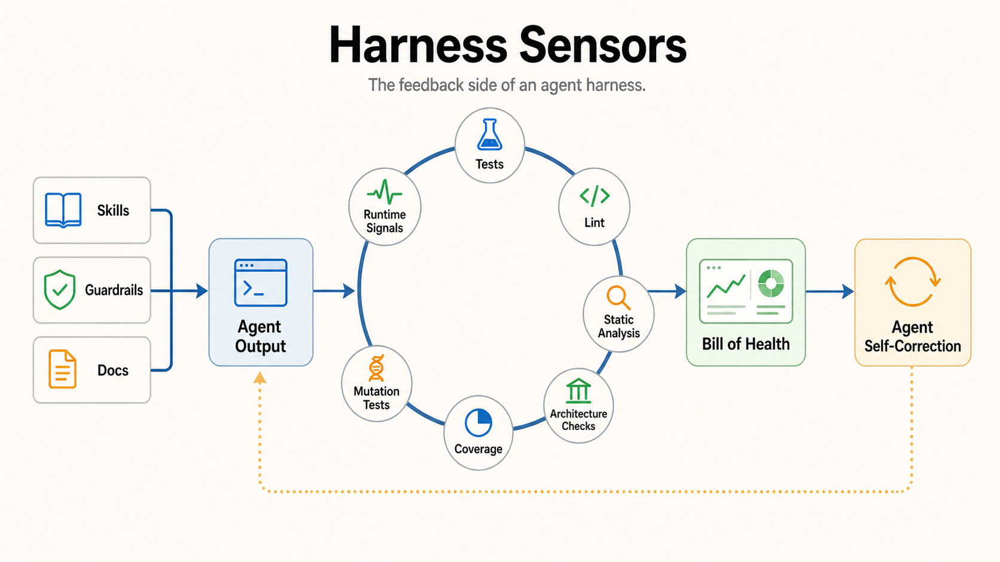

# Harness Sensors

Harness sensors are the feedback side of an agent harness: tools and signals
that observe what a coding agent actually produced, then help the agent or human
decide what to repair next.

This brief is derived from two Birgitta Böckeler sources:

- ["Harness engineering for coding agent users"](https://martinfowler.com/articles/harness-engineering.html)
  (martinfowler.com, April 2, 2026) — the primary articulation of guides and
  sensors, the computational and inferential split, regulation
  categories, harnessability, and harness templates.
- ["Harness engineering and agent feedback: Exploring AI coding sensors"](https://www.thoughtworks.com/en-us/insights/blog/generative-ai/harness-engineering-agent-feedback-exploring-ai-coding-sensors)
  (Thoughtworks, with Chris Ford, May 13, 2026) — the follow-on experiment
  applying sensors to a TypeScript dashboard.

It is a companion to [Harness Engineering](harness-engineering.md), which
covers the broader operating model, and
[Context Engineering](context-engineering.md), which covers what the model sees
while working.

See also Thoughtworks' companion podcast
["What is harness engineering?"](https://www.thoughtworks.com/en-us/insights/podcasts/technology-podcasts/what-harness-engineering),
which reinforces the distinction between guides as feed-forward and sensors as
feedback. It also distinguishes a product agent's built-in harness from the
outer harness supplied by its repository and team.

## Core Frame

A harness has two sides:

| Side | Role | Examples |
| --- | --- | --- |
| Feed-forward | Tell the agent what good looks like before generation. | Skills, guardrails, coding conventions, principles, reference docs. |
| Feedback | Show the agent what it actually produced after generation. | Tests, lint, static analysis, architecture checks, coverage, mutation tests, runtime signals. |

Feed-forward reduces ambiguity. Feedback catches drift.

[Context engineering](context-engineering.md) cuts across both sides: it shapes
feed-forward material before generation and curates the working set in flight:
message history, tool results, retrieval, notes, compaction, and subagents.
Treat the two-column table as the source article's framing for sensors, not as a
claim that every harness concern is purely pre- or post-generation.

In an ideal world, instructions and guardrails would be enough. In real
software, agents need sensors because they do not reliably satisfy every
constraint on the first pass.

## Sensors

Sensors are tools that inspect agent output and return actionable signals.

Good sensors:

- run cheaply enough to be part of the agent loop
- produce clear pass/fail or prioritized findings
- point toward remediation
- reduce the need for humans to inspect huge diffs
- preserve standards while agent throughput rises

Sensors are not only for humans. They are inputs the agent can use to
self-correct before a human reads the change.

## Sensor Taxonomy

Thoughtworks separates sensors into two broad categories:

| Sensor type | Meaning | Strength |
| --- | --- | --- |
| Computational | Deterministic tools with formal rules. | High assurance for objective constraints. |
| Inferential | Signals the agent or human must interpret. | Useful for fuzzy, exploratory, or qualitative judgment. |

Computational feedback is especially valuable when the rule is objective:
formatting, dependency boundaries, test failures, coverage thresholds, mutation
survival, security patterns, or API contracts.

Inferential feedback is useful when the work requires judgment: readability,
design intent, product fit, architecture tradeoffs, and whether a warning
matters in context.

The harness should use both. Use deterministic checks wherever the constraint is
clear. Reserve inferential judgment for places where the rule is genuinely fuzzy.

## Example Sensors

The article's TypeScript dashboard experiment used sensors such as:

- ESLint for linting
- Semgrep for static analysis
- Dependency Cruiser for structural boundaries
- coverage reports for test reach
- mutation testing for test quality

Those tools are examples, not a fixed stack. The durable pattern is to expose
code quality, architecture, and test-quality signals to the agent as part of the
normal loop.

## The Steering Loop

The human's job is to steer the agent by iterating on the harness. Whenever an
issue happens more than once, the feed-forward or feedback controls should be
improved so the issue becomes less probable or impossible.

Agents can help build their own harness: writing structural tests, drafting
rules from observed failure patterns, scaffolding custom linters, and creating
how-to guides from codebase archaeology. Cheap implementation makes custom
sensors economical in a way they were not before.

## Keep Quality Left

Sensors have costs, so they must be distributed across the change lifecycle:

- fast, cheap checks run before integration or even before a commit exists
  (linters, fast tests, a basic review agent)
- expensive checks run post-integration in the pipeline (mutation testing,
  broad architecture review)
- drift detectors run continuously against the codebase outside any single
  change (dead-code scans, coverage-quality analysis, dependency scanners)
- runtime sensors watch the deployed system (SLO degradation, log anomalies,
  response-quality sampling)

The earlier a sensor fires, the cheaper the repair.

## Regulation Categories

The harness regulates the codebase toward a desired state along distinct
dimensions:

| Category | Regulates | Maturity |
| --- | --- | --- |
| Maintainability harness | Internal code quality: duplication, complexity, coverage, style, structure. | Most mature; rich pre-existing tooling. |
| Architecture fitness harness | Architecture characteristics: performance budgets, observability standards, boundary rules. | Established as fitness functions. |
| Behaviour harness | Whether the application functionally does what is needed. | The open problem. |

The behaviour harness is the hardest gap. Most current practice feeds forward a
functional spec and feeds back an AI-generated test suite plus coverage, which
puts heavy faith in tests the agent wrote for itself. Patterns such as approved
fixtures help selectively, but verifying functional correctness well enough to
reduce supervision remains unsolved.

A test runner is computational: given a test suite, it returns a deterministic
result. But an AI-authored test suite is inferential in how it chooses which
behavior to encode and which assertions count as proof. Green output does not
make those choices correct.

Sensors also have limits within maintainability: computational checks catch
structural issues reliably, inferential checks partially catch semantic issues,
and neither reliably catches misdiagnosis, overengineering, or misunderstood
instructions. Correctness is outside any sensor's remit if the human never
specified what they wanted.

## Exceptions Are Review Signals

Computational sensors need an explicit escape hatch for cases where a warning is
acceptable. A suppression should preserve the judgment in the codebase instead
of silently discarding the signal.

Useful exceptions:

- require a local justification
- stay as narrow as possible
- remain searchable and reportable
- give reviewers a starting point for inspecting overridden rules
- preserve the sensor so later growth can still trigger it

## Harnessability

Not every codebase is equally amenable to harnessing. Typed languages give
type-checking as a free sensor; clear module boundaries afford structural
rules; strong frameworks remove whole classes of agent error. Böckeler calls
the underlying properties "ambient affordances": structural properties of the
environment that make it legible, navigable, and tractable for agents.

Greenfield teams can bake harnessability in from day one. Legacy teams face the
harder version: the harness is most needed where it is hardest to build.

## Bill Of Health

A useful harness can summarize sensor output as a bill of health.

That dashboard answers:

- what is green?
- what is red?
- which signals matter most?
- where should the agent repair next?
- where should a human reinvest in the harness?

The point is not to create another noisy dashboard. The point is to collapse many
signals into an actionable view of whether the codebase is healthy enough to keep
moving.

## Harness Templates

Thoughtworks points toward harness templates: reusable starting points for
different kinds of software.

Examples:

- a CRUD business service template
- a data dashboard template
- an API integration template
- a frontend application template

Each template would include both feed-forward material and sensors:

- docs and conventions
- architecture rules
- test strategy
- lint and static analysis
- dependency boundaries
- quality thresholds
- runtime verification paths

The insight is that different application archetypes need different harnesses.
There is no universal set of sensors that fits every repo.

Böckeler grounds this in Ashby's Law of Requisite Variety: a regulator can only
regulate what it has a model of. An agent can produce almost anything, so
committing to a known topology narrows the space and makes a comprehensive
harness achievable. Choosing a topology is a variety-reduction move, and teams
may eventually pick stacks partly based on which harnesses already exist for
them.

## Human Role

Harness sensors do not remove the human from the loop. They raise the level at
which the human operates.

Instead of reading every line of a large generated diff, the human can inspect:

- the bill of health
- the remaining red signals
- the agent's repair history
- the tradeoffs that still require judgment

That gives the developer situational awareness and lets them steer at a higher
level of abstraction.

## Concept Fidelity Map

| Source concept | Preserved here as | Why it matters |
| --- | --- | --- |
| Outer harness | Agent environment | The harness surrounds generation with context and checks. |
| Feed-forward | Skills, guardrails, docs | The agent needs constraints before it acts. |
| Feedback | Sensors | The agent needs evidence after it acts. |
| Sensors | Output-observing tools | The harness must inspect generated work. |
| Computational feedback | Deterministic checks | Objective rules should become executable. |
| Inferential feedback | Interpreted signals | Some quality judgments need context. |
| TypeScript dashboard experiment | Example sensor stack | Demonstrates sensors improving quality over iterations. |
| Steering loop | Iterating on the harness | Repeated issues should improve controls, not just get re-fixed. |
| Keep quality left | Lifecycle-distributed sensors | Earlier signals are cheaper to act on. |
| Regulation categories | Maintainability, architecture fitness, behaviour | Names what each control is for and where coverage is weak. |
| Behaviour harness gap | Unsolved functional verification | AI-graded AI tests are not yet trustworthy enough to drop supervision. |
| AI-authored tests | Computational result over inferential test design | A deterministic runner cannot prove that generated assertions encode the right behavior. |
| Documented suppressions | Reviewable exception decisions | Narrow, searchable overrides preserve judgment without disabling the sensor. |
| Harnessability / ambient affordances | Codebase properties enabling controls | Types, boundaries, and frameworks determine which sensors are even possible. |
| Bill of health | Sensor dashboard | Humans need a compact view of codebase state. |
| Harness templates | Archetype-specific starting points | Different apps need different guides and sensors. |
| Ashby's Law | Topology as variety reduction | A harness can only regulate what it can model. |
| Situational awareness | Higher-level steering | Humans should focus on intent and judgment, not raw diff volume. |

## Relationship To Harness Engineering

[Harness Engineering](harness-engineering.md) describes the full operating
model: repository context, runtime legibility, mechanical constraints, review
loops, autonomy, and cleanup.

Harness sensors zoom in on one load-bearing part of that model: feedback. They
make the harness less dependent on one-shot instructions by giving agents and
humans a reliable way to see what actually happened.

[Context Engineering](context-engineering.md) is the input and in-flight
companion: it curates what the model sees on each turn. Harness sensors are the
output companion: they evaluate what the agent produced and return repair
signals.
