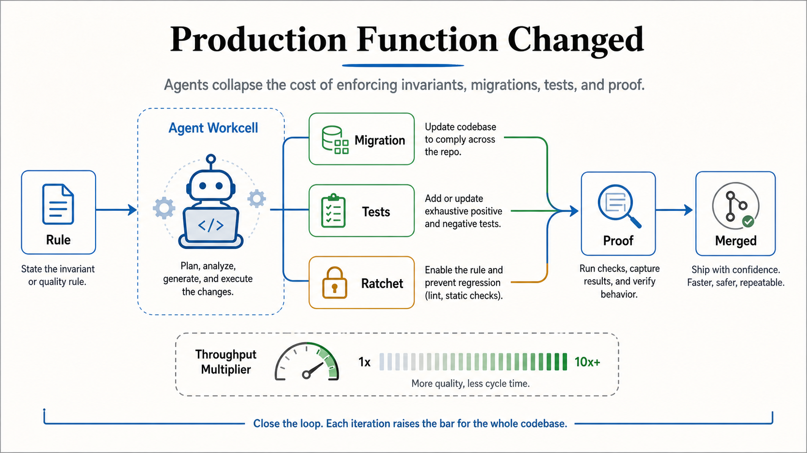

# Production Function Changed

The production function changed when implementation effort stopped being the
most expensive part of many software improvements. Agents make it cheaper to
encode rules, migrate call sites, add tests, and ratchet the codebase so the
same mistake does not return.

This brief is derived from Ryan Lopopolo's article
["The Production Function Changed"](https://hyperbo.la/w/production-function-changed/),
published March 13, 2026. Lopopolo also wrote the OpenAI article translated in
[Harness Engineering](harness-engineering.md); this essay generalizes lessons
from that same agent-first experiment. It is a companion to
[Harness Engineering](harness-engineering.md), because it explains the economic
reason harnesses should convert taste and invariants into executable checks.

## Core Frame

In a human-first codebase, the team may know the better rule but avoid enforcing
it because the migration cost is too high.

In an agentic codebase, the cost profile changes:

- state the invariant
- enable or write the rule
- migrate the violations
- add positive and negative tests
- ratchet the check so regressions fail
- require proof before merge

The insight is not that every change is free. The insight is that many
previously uneconomical quality improvements become cheap enough to do
correctly.

## The Old Tradeoff

Software teams often ship the cheap version even when everyone knows what the
better version looks like.

Examples:

- network calls should have timeouts and retries
- unsafe wrappers should replace raw filesystem access
- CI workflows should satisfy stricter static checks
- durations and IDs should use branded types instead of raw strings or numbers
- preference systems should model defaults and unset states explicitly

Those ideas are not novel. The expensive part was applying them consistently
across a real codebase, proving the migration, and preventing regression.

## The Agentic Move

Agents change the move from "we should do this someday" to "encode the rule and
make the repo comply."

That requires a harness:

- instructions that name the invariant
- tools that can scan and rewrite the codebase
- tests and fixtures that prove the new behavior
- static checks or lints that keep the door closed
- review workflow that asks for logs, screenshots, videos, or other proof when
  runtime behavior matters

Implementation gets cheaper, so proof becomes more important.

## Ratchets

A ratchet is the part of the harness that prevents the same class of defect from
coming back.

Good ratchets are mechanical:

- lint rules
- static analysis
- dependency boundaries
- type constraints
- test fixtures
- CI gates
- custom repository checks

The production-function change matters because a ratchet is often not only the
rule. It is the rule plus the migration plus the proof that the whole repo now
complies.

## Higher-Level Abstractions

The article also applies the same economics to design quality.

When fiddly implementation work gets cheaper, teams can choose the right
abstraction instead of watering it down to fit the old cost model. A more
precise preference stack, feature-flag system, or domain-specific API can become
worth building because the agent can help carry the mechanical work.

That does not remove judgment. It moves judgment earlier:

- which invariant matters?
- which abstraction is actually better?
- what should become a rule?
- what proof is enough?
- when is uniformity worth enforcing?

## Concept Fidelity Map

| Source concept | Preserved here as | Why it matters |
| --- | --- | --- |
| Production function changed | New cost model | Agentic implementation changes what quality work is worth doing. |
| Enable a rule and fix many violations | Rule plus migration | Agents make broad cleanup less prohibitive. |
| Positive and negative tests | Proof fixtures | The harness must show the rule works and rejects bad cases. |
| Ratchet | Regression prevention | Quality improvements should become durable gates. |
| Static checks and lint rules | Mechanical enforcement | Taste and invariants should be executable when possible. |
| Proof over watching code appear | Evidence-oriented review | Fast generation increases the need for logs, screenshots, and checks. |
| Right abstraction for same price | Higher-level design leverage | Cheaper implementation lets teams stop accepting avoidable mess. |

## Relationship To Agentic Engineering

[Harness Engineering](harness-engineering.md) describes the harness as the
repository, documentation, tools, checks, skills, runtime access, review loop,
and cleanup system around agents.

The production-function change explains why that harness is worth building. If
agents make implementation cheap but proof and judgment remain expensive, then
the highest-leverage work is encoding invariants and closing verification loops.

[Harness Sensors](harness-sensors.md) are one way to operationalize this shift:
they turn broad rules into feedback agents can use before humans spend attention
on the diff.
